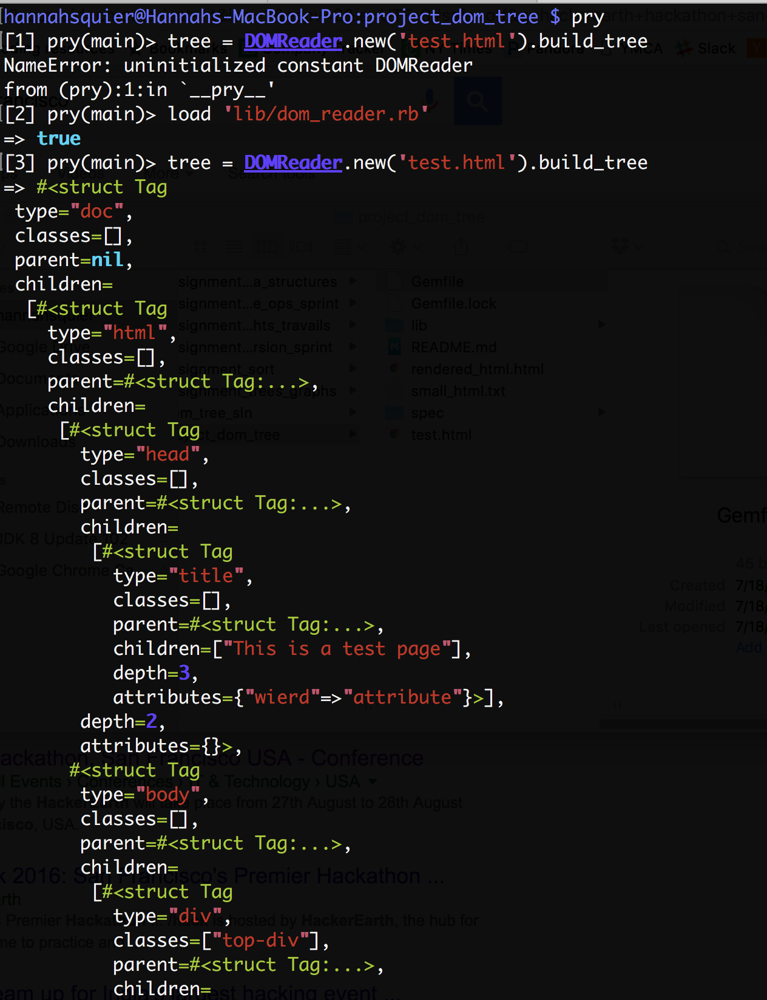
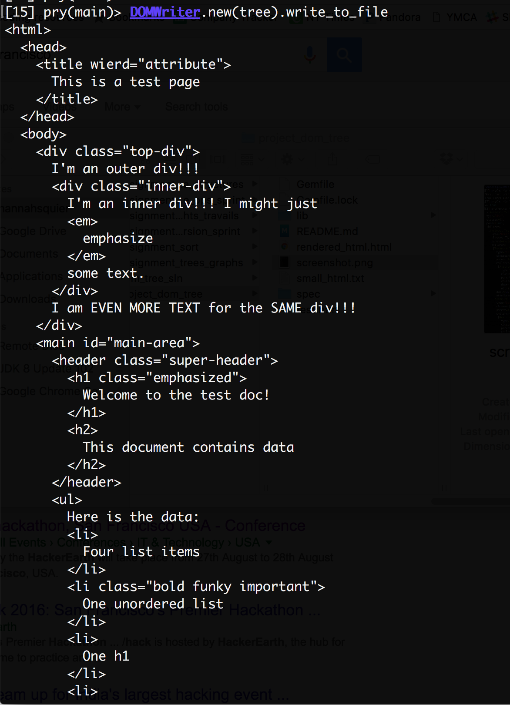

🌲 DOM Tree Parser

This DOM Tree parser reads in HTML files and parses it into individual nodes.
The tool

# :memo: DOM Tree Parser Built with Ruby

With this application, you can convert any HTML file into a node based DOM Tree. The program can also build the original file back from the tree.

## Prerequisities

You will need to have Ruby and Pry (or some other Ruby REPL) installed on your computer to run this program.
See [this link](https://www.ruby-lang.org/en/downloads/) to download Ruby.

## Getting Started

First fork this repo and copy the link to your fork of the repo. Then enter the following lines into your command line to build your DOM Tree.

```
git clone "your-link-to-your-fork-of-repo"
cd dom-tree
pry
load 'lib/dom_reader.rb'
tree = DOMReader.new('file.html').build_tree
```
You can now play with this document object and access attributes, children, classes, id's and depths. See the screenshot below:



To turn the DOM back into an HTML file, enter the following lines into your command line.

```
DOMWriter.new(tree).write_to_file("path/to/file")
```



## Built With

* Sublime
* Ruby
* RSpec

## Acknowledgments
Thanks to [Viking Code School](https://github.com/vikingeducation) for creating this assignment.

### Get in touch if you are having any issues!